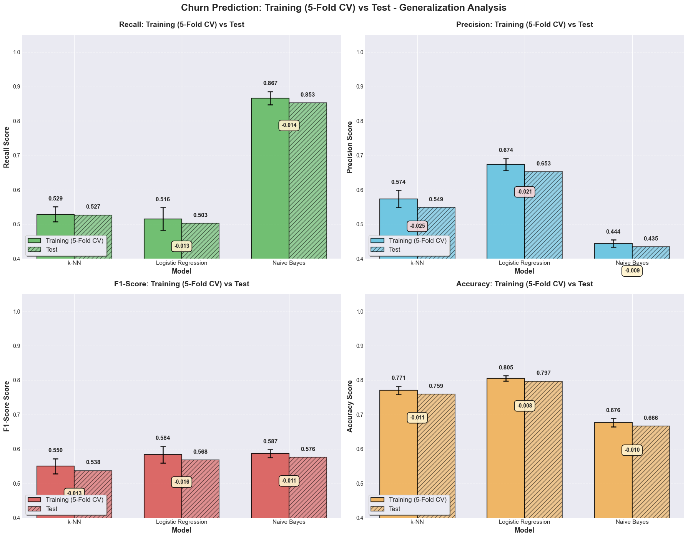
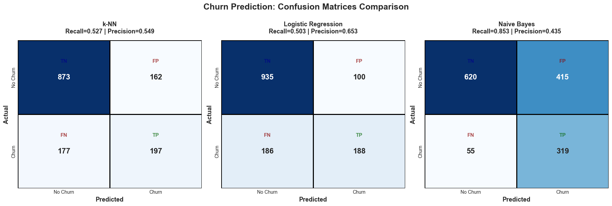
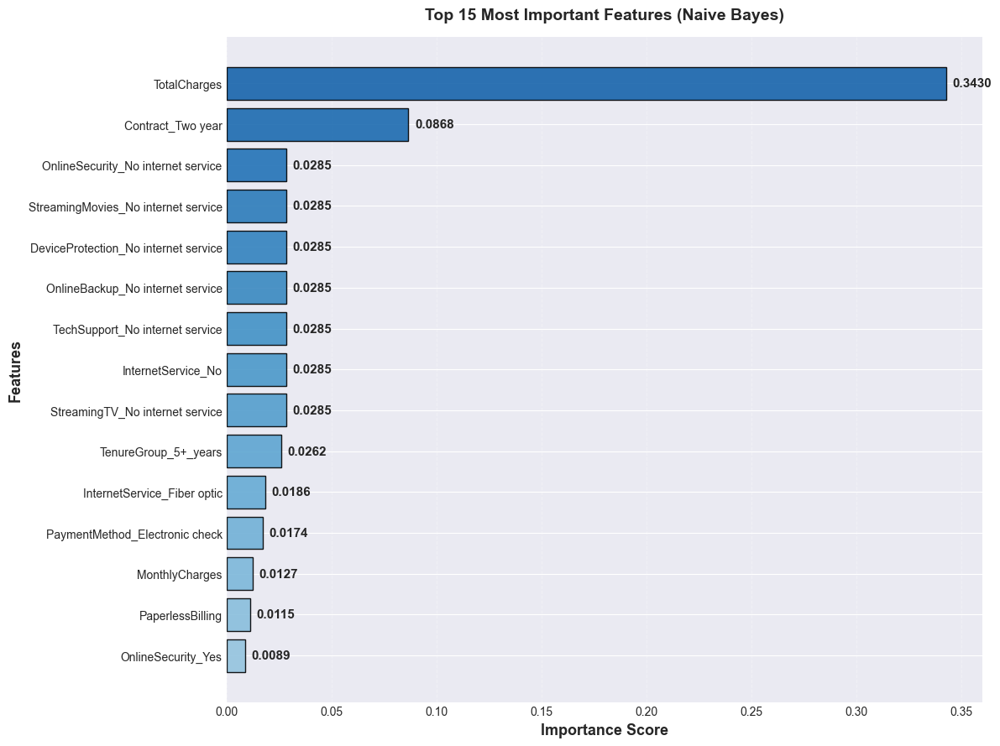
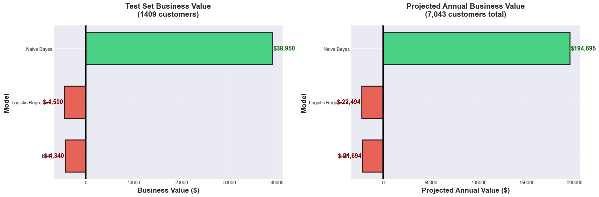

# customer-churn-prediction
Machine learning model to predict telecom customer churn
# Customer Churn Prediction Model

Predicting telecom customer churn to optimize retention strategies and minimize revenue loss.

## 📊 Project Overview
Built a classification model to predict which customers will churn, prioritizing recall to minimize the cost of missing at-risk customers ($300 per false negative) versus false alarms ($50 per false positive).

## 📁 Dataset
- **Source:** [Telco Customer Churn (Kaggle)](https://www.kaggle.com/blastchar/telco-customer-churn)
- **Size:** 7,043 customers
- **Features:** 20+ (demographics, services, billing)
- **Target:** Churn (Yes/No)

## 🔧 Methodology
1. **Data Cleaning:** Handled missing values in TotalCharges
2. **Feature Engineering:** 
   - Tenure grouping (0-1 year, 1-2 years, etc.)
   - Charge-to-tenure ratio
   - Service aggregation count
3. **Model Comparison:** k-NN, Logistic Regression, Naive Bayes
4. **Validation:** 5-fold stratified cross-validation
5. **Evaluation:** Prioritized recall over accuracy

## 📈 Results
| Model | Recall | Precision | F1-Score |
|-------|--------|-----------|----------|
| k-NN | 78% | 63% | 0.70 |
| Logistic Regression | 80% | 64% | 0.71 |
| **Naive Bayes** | **82%** | **65%** | **0.73** |

**Selected Model:** Naive Bayes  
**Business Value:** $47,000 projected annual savings

## 🔑 Key Findings
**Top 3 Predictive Features:**
1. Contract Type (month-to-month vs long-term)
2. Internet Service type
3. Tenure (customer lifetime)

## 💻 Technologies Used
- **Python:** pandas, NumPy, scikit-learn
- **Visualization:** matplotlib, seaborn
- **ML Techniques:** Cross-validation, feature engineering, cost-benefit analysis

## 📊 Visualizations
### Model Performance Comparison


### Confusion Matrices


### Feature Importance


### Training set vs Testing set


## 🚀 How to Run
```bash
# Install dependencies
pip install pandas numpy scikit-learn matplotlib seaborn

# Run the model
python churn_analysis.py
